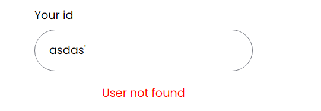

# Instrukcja - SalesGo

## 1. Wymagania

- npm

  > npm -v

- node.js
  > node -v

## 2. Uruchomienie

> Pobierze repozytorium

- git clone https://github.com/MarvelousMarcin/NoteShare
  > Pobierz wszystkie potrzene pakiety w foldrze backend
- cd backend
- npm i
  > i pobierz frontend
- cd frontend
- npm i
  > Aby backend działał prawidłowo musisz też dodać plik .env odpowiedną zawartością >
- PORT=4000
- JWT_TOKEN="super_secret_code"
  > Musisz uruchomić teraz frontend i backend
- backend: npm run dev
- frontend: npm start

## 3. Logowanie

Jeżeli masz konto po prostu wpisz swój unikalny kod sprzedawcy. Jeżeli login osoby nieistiejącej zostaniesz o tym poinformowany.

### Strona logowania

## 3. Rejestracja

### Strona rejestracji

