# Instrukcja - SalesGo

## 1. Wymagania

- npm

  ```
  npm -v
  ```

- node.js
  ```
  node -v
  ```

## 2. Użyte technologie

<ol>
  <li><a href="https://reactjs.org/" target="blank">React</a></li>
  <li><a href="https://reactrouter.com/en/main">React Router</a></li>
  <li><a href="https://www.framer.com/motion/">framer-motion</a></li>
  <li><a href="https://tailwindcss.com/">Tailwind</a></li>
  <li><a href="https://redux.js.org/">Redux</a></li>
  <li><a href="https://redux-toolkit.js.org/">Redux Toolkit</a></li>
  <li><a href="https://mui.com/">Material UI</a></li>
  <li><a href="https://www.chartjs.org/">Chart JS</a></li>
  <li>JWT - Json Web Token</li>
  <li><a href="https://nodejs.org/en/">node.js</a></li>
  <li><a href="https://expressjs.com/">express</a></li>
  <li><a href="https://www.mongodb.com/">MongoDB</a></li>
</ol>

## 3. Uruchomienie

> Pobierze repozytorium

- git clone https://github.com/MarvelousMarcin/NoteShare
  > Pobierz wszystkie potrzene pakiety w foldrze backend
- cd backend
- npm i
  > i pobierz frontend
- cd frontend
- npm i
  > Aby backend działał prawidłowo musisz też dodać plik .env odpowiedną zawartością >
- PORT=4000
- JWT_TOKEN="super_secret_code"
  > Musisz uruchomić teraz frontend i backend
- backend: npm run dev
- frontend: npm start

## 4. Logowanie

Jeżeli masz konto po prostu wpisz swój unikalny kod sprzedawcy.

### Strona logowania

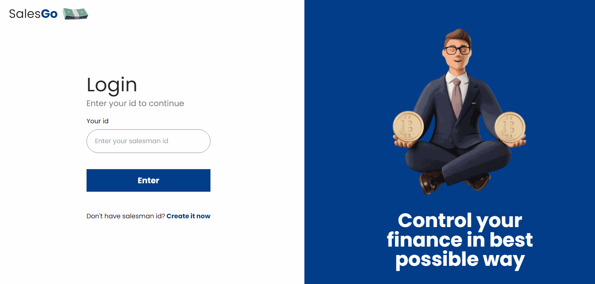

Jeżeli podasz login osoby nieistiejącej, zostaniesz o tym poinformowany.

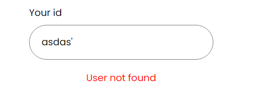

## 5. Rejestracja

Jeżeli konta nie masz możesz je zrobić. **Loginy nie mogą się powtarzać.**

### Strona rejestracji

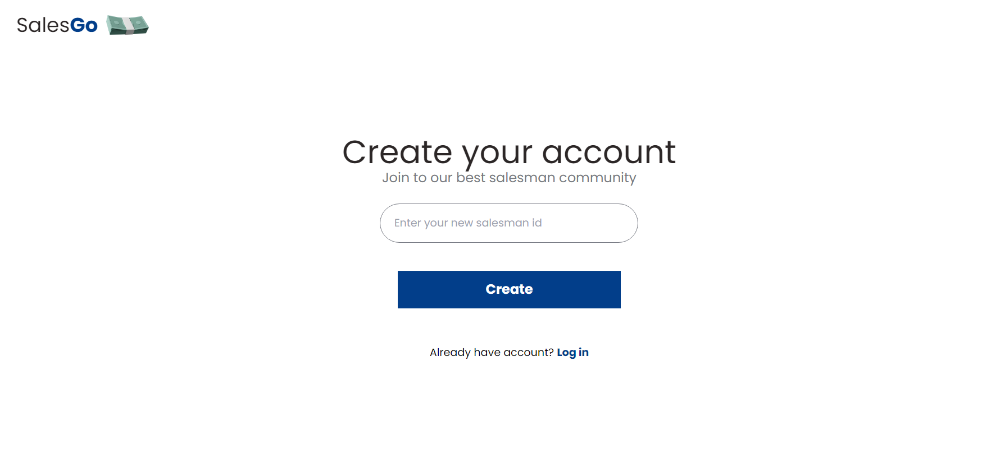

## 6. Strona Główna Dashboard

Po wpisaniu prawidłowego loginu, zostaniesz przeniesiony na swoją stronę główną ze wszystkimi najważniejszymi danymi dla sprzedawcy.

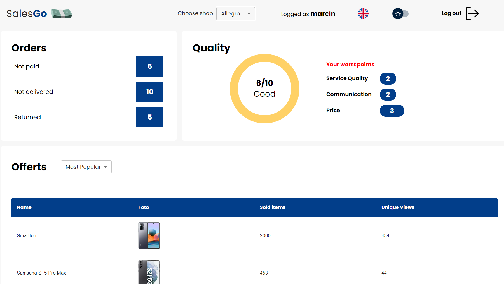

## 7. Widżet Zamówień

Widżet zamówień pokazuje trzy kategorie zamówień oraz liczbę takich zamówień w systemie. Mamy zamówienia nieopłacone, niedostarczone oraz zwrócone.

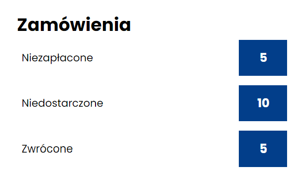

## 8. Widżet Jakości

Widżet jakości pokazuję naszą ogólna ocenę jako sprzedawcy a wraz z nią jedną z 5 kategorii. Na ocenę składają się tzw. aspekty jakości z których wyliczana jest średnia - **końcowa ocena jakości**. Dodatkowo z prawej strony mamy zaprezentowane trzy aspekty w których wypadamy najgorzej.
Dostępne kategorie do uzyskania:

- Perfect - **Perfekcja**
- Excellent - **Wspaniale**
- Good - **Dobrze**
- Bad - **Źle**
- Horrible - **Tragicznie**

### Kategoria - **Dobrze**

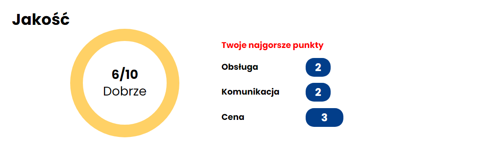

### Kategoria - **Źle**

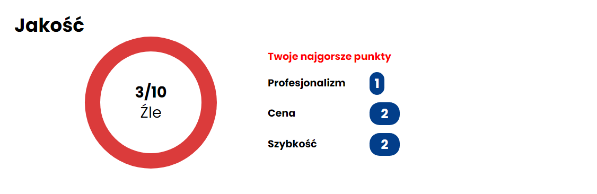

## 9. Widżet Ofert

Widżet ofert pokazuje nam 5 najbardzije popularnych lub najmniej popularnych ofert. Rodzaj sortownia możemy sobie ręcznie ustawić. Tabela prezentuje nam nazwę, zdjęcie, liczbę sprzedanych produktów oraz liczbę wyświetleń lub obrót oferty.

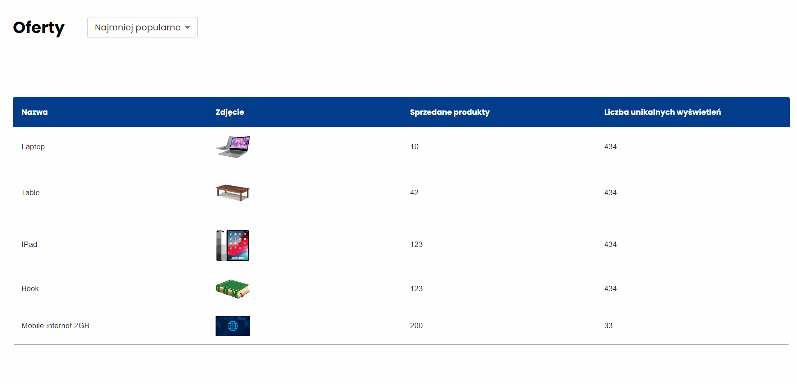

## 10. Widżet Opinii

Widżet opinii prezentuje pięc opinii dotyczących sprzedawcy. Możemy wybrać filtrowanie opinii tylko pozytywnych, wszystkich lub tylko negatywnych.

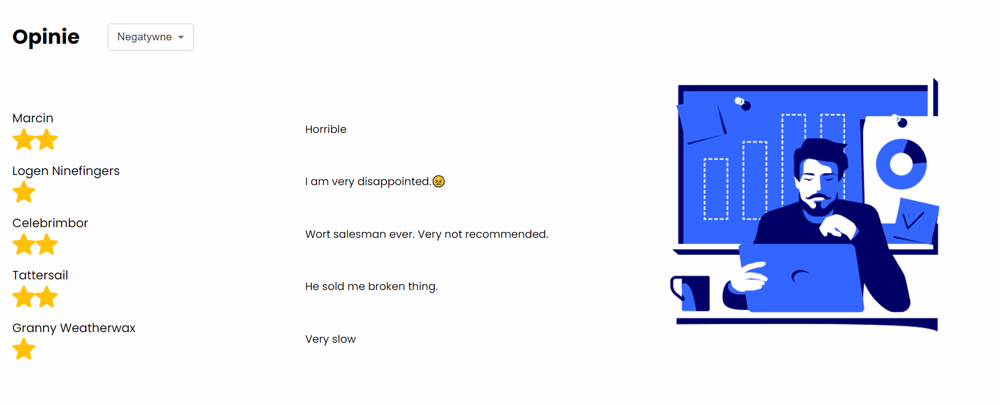

## 11. Widżet Wykresu Sprzedaży

Wykres sprzedaży pokazuje nam statystykę odnośnie naszych zamówień. Możemy go parametryzować przy użyciu opcji.

> **Wybrać Obrót lub Liczbę sprzedanych produktów** 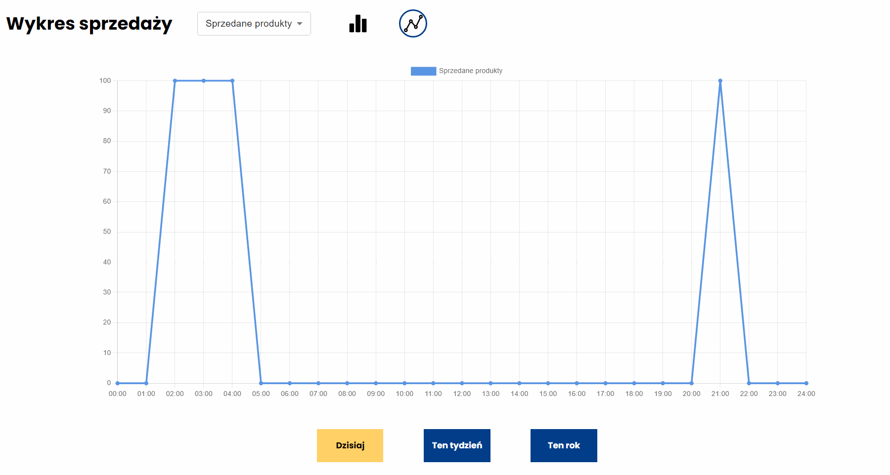

> **Wybrać dane z Dzisiaj, Tego Tygodniu lub Tego Roku** 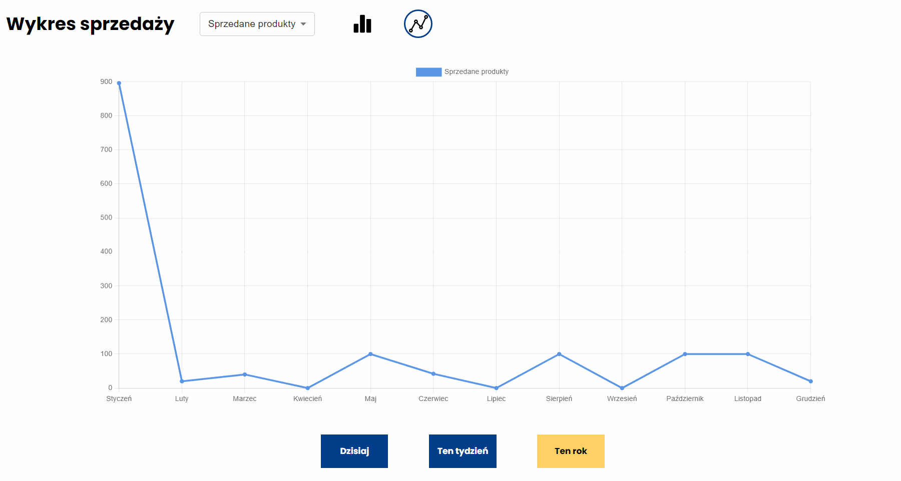

> **Wybrać typ wykresu - Słupkowy lub liniowy** 

## 12. Widżet Porad Sprzedażowych

W wydżecie możemy znaleźć porady dotyczące naszych działań, generowane automatycznie bazując na naszych ofertach oraz zamówieniach.

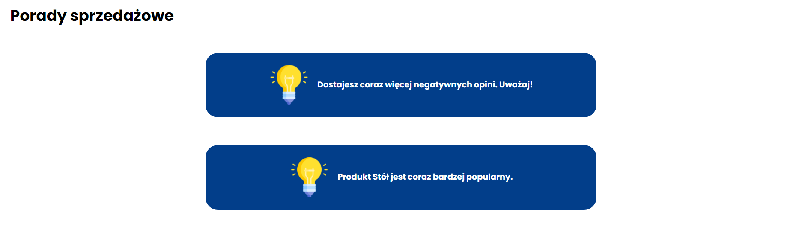

## 13. Dark Mode

### Włączanie Dark Mode


## 14. Zmiana języka

### Zmiana języka na polski

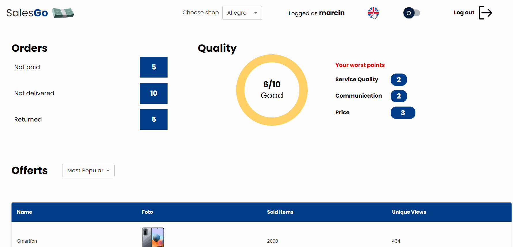

## 15. Zmiana sklepu

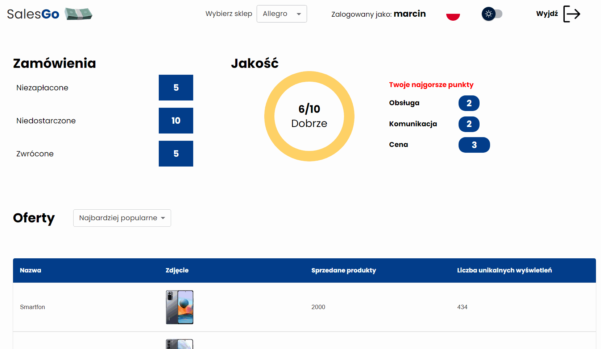

```

```
